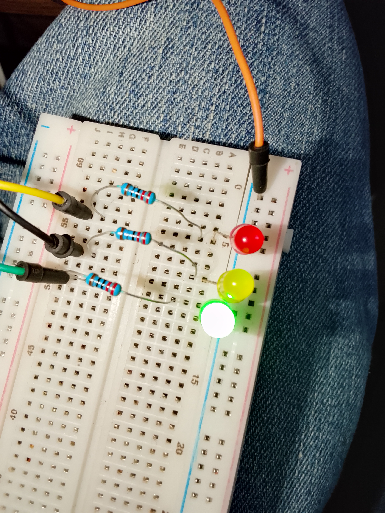

# Software Scheduler_project_using_stm32f401ccu6

## Overview
This project demonstrates a simple software scheduler implemented on the STM32F401CCU6 using timer tick interrupts. Multiple tasks are executed at different time intervals without blocking the CPU, introducing the basic concepts behind Real-Time Operating Systems (RTOS).

## Project Code
[Click here to check out the project code](code)

## Project images

## Final Outcome
- Three LEDs execute independent periodic tasks.
- Each LED toggles at a different time interval.
- Tasks run concurrently using a timer-based software scheduler.

## Features
- Software task scheduling
- Periodic task execution
- Timer tick interrupt
- Non-blocking program execution
- Register-level (Bare-Metal) STM32 programming

## Project Demo Video

[Click here to check out the Demo Video](https://youtube.com/shorts/5fUm4q9-m-U)

## Hardware Used
- STM32F401CCU6 Black Pill
- ST-Link V2 Programmer
- 3 × LEDs
- 3 × 220Ω Resistors
- Breadboard
- Jumper Wires

## Learning Objectives
- Understand software scheduling concepts.
- Learn how timer tick interrupts drive periodic tasks.
- Explore RTOS-like scheduling fundamentals.
- Improve embedded programming using non-blocking techniques.

## Project Status
✅ Completed
